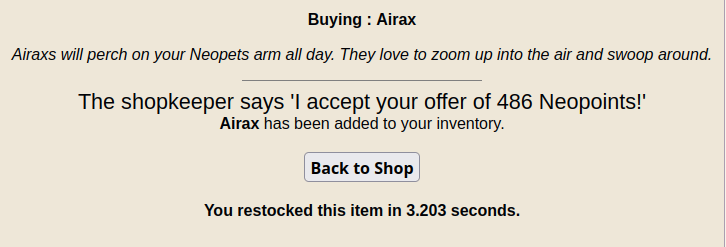

# Restock timer

Adds a restock timer (last line in the screenshot) to your restocks on neopetsclassic.

### Files
- `restockTimer.ts` is the source code of the userscript
- `transform.js` wraps the JS that tsc emits into a userscript
- `restockTimer.js` is the userscript, this is the file you should pubish

### Scripts
- `npm run dev` to watch and build
- `npm run build` to build the output once